<h1 align="center">Word Guess Game</h1> 
A unique Word Guess Game written in Python and played in the terminal.

- 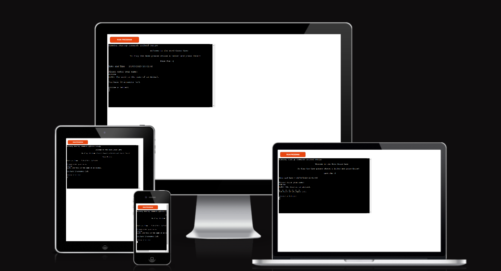

## Introduction
This game displays a secret word that reveals the length of the word through underscores to represent a letter. A hint is given to the user about the word. The user has 10 attempts to guess the word before he/she runs out of the attempts. As the number of attempts descrease, the number of guesses increases. On winning the game the scores are calculated (5 * with number of guesses) because when someone succeeds every attempt matters. So every guess will be rewarded. The highest score is added to the Scoreboard in the google spreadscheet. In case of loosing the game, the score is displayed and is not added to the Scoreboard.

The random word is chosen from different lists defined in the project.

## Inspiration

I used to play this game with my husband and kids on weekends and we used to have a lot of fun playing it. The kids were happy when they won and they were at the same time learning new words and increasing their English vocabulary. It was the first thing that i had in my mind for my Python project and i enjoyed a lot working on it. My husband and kids have played it after i was finished implementing it and they find it quite intriguing.

## Basic Information
The purpose of this game is a simple word guess game for entertainment purposes in a terminal environment using Python.

The game is designed keeping the user experience in mind:

- The user wants to enjoy playing the word game.
- The user wants to get a hint about the word.
- The user wants to win the game and get a winning message and scores to be displayed when he/she   
  wins.
- The user wants to have clear instructions.
- The user wants to get rewarded on each guess if he/she wins.
- It provides clear error messages to help the user enter valid input.
- The user wants the highest scores to be available in the scoreboard.

## Features
- Welcome 
  - The game starts and displays a welcome message, an instruction to the user and also displays 
    date and time. Then the user is asked to enter his/her name.

- 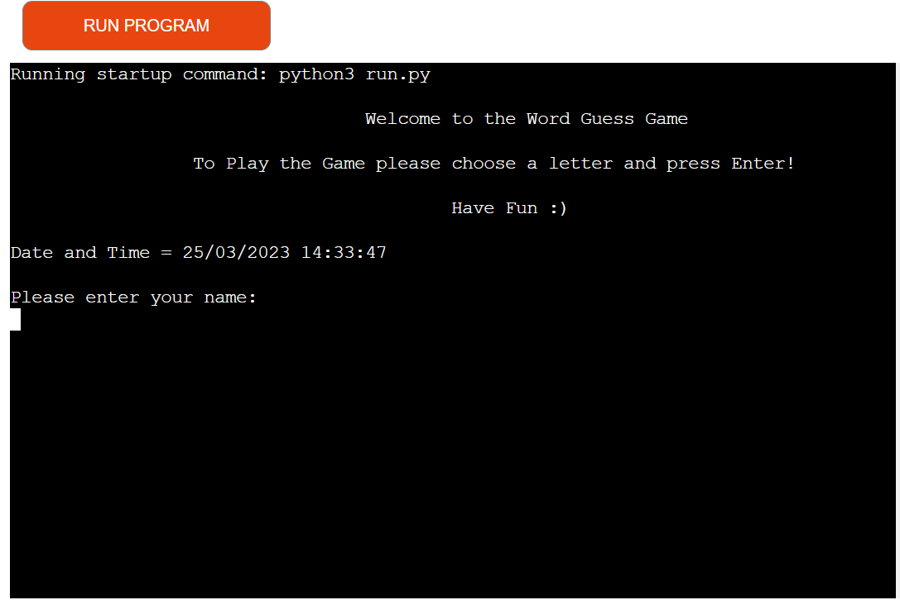

- Game Start
  - Game starts when the user types his/her name and then presses enter in order to start playing.  
    A random word is displayed to the user with a Hint. Now the user needs to guess the word. The total number of attempts are 10 and are displayed to the user.  

- 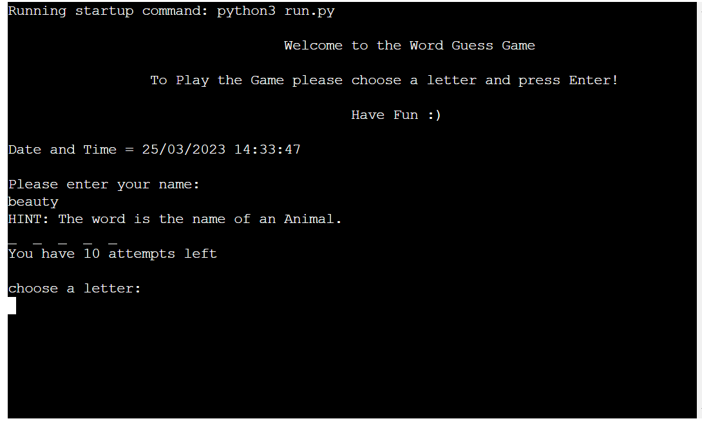

- End
  - In case the user is able to successfully guess the word or fails to guess it, a message will be 
    displayed to the user asking him/her to play again or not.

- 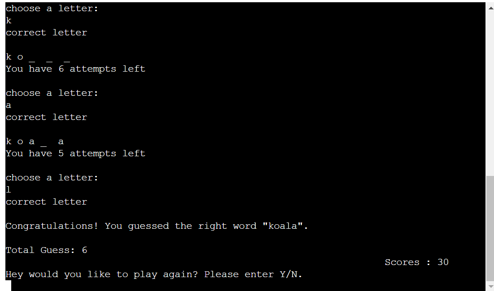

- Leaderboard
  - After exiting the game the user's score is displayed along with a Leaderboard.
    The Leaderbord shows only the recent score of the user as everyone wants to see his/her best results :)

- 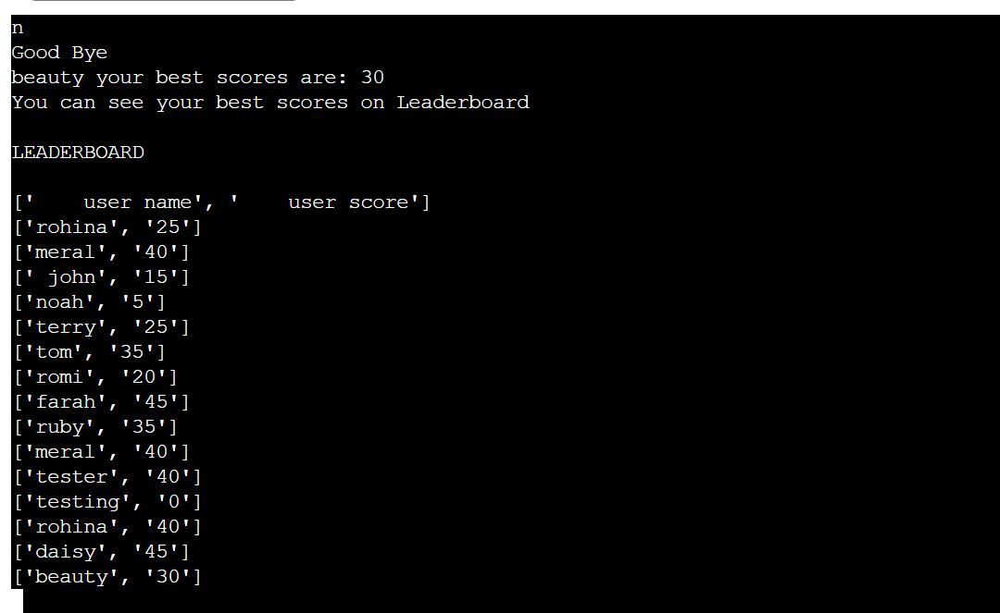

- Score-board
  - Once the game is finished the highest scores is added to the scoreboard in the           
    google spreadsheet. 

- 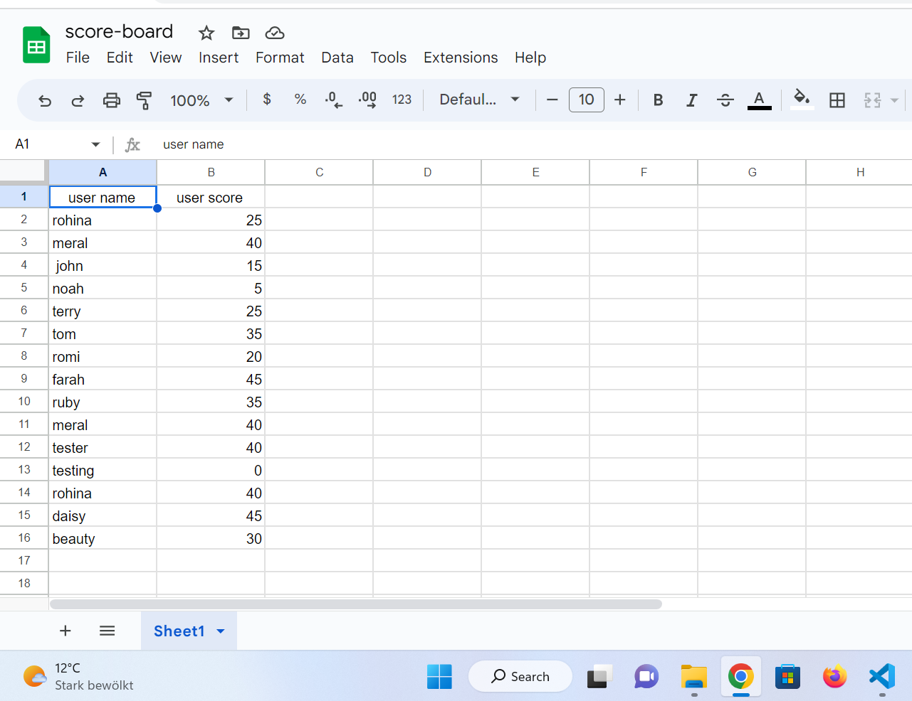

- Loose
  - In case the user fails to guess the word and loose the game the score is displayed on the 
    Leaderboard but is not added to the Scoreboard.

- 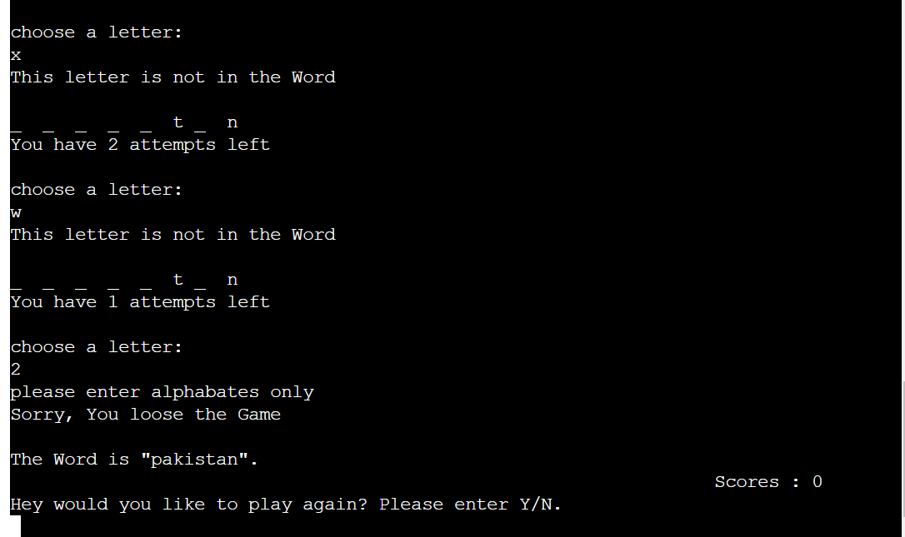

## Testing

- Tested and validated the code and user input in Heroku terminal. In case a user inputs digits,  
empty space or couple of letters together a message will be displayed to the user saying that the input is not valid.

- The Guess Word game displays to the player in the the terminal. Player needs to input his/her name, then press enter in order to start the game. A hint about the word and total number of attempts always displays to the player..  

Game Start

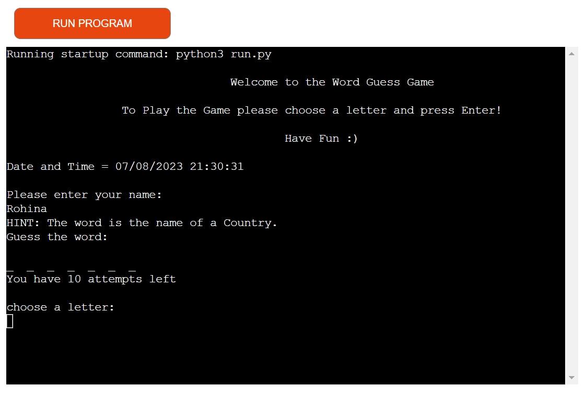 

 

- Whenever the player inputs a correct guess the letter displays on the right place in the word, a success message and remaining number of attempts also displays to the player. 

Correct Guess

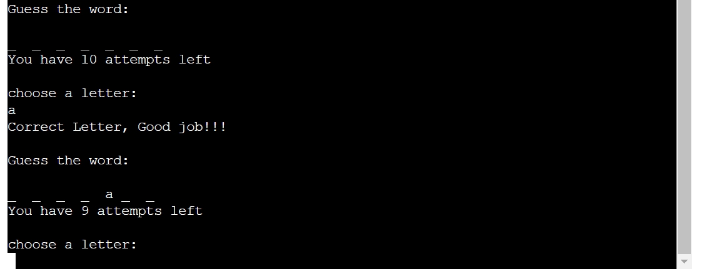 

 

- When the player inputs a wrong guess, a warning message and remaining number of attempts displays to the player. On each wrong guess player looses 1 remaining number of attempts.  

Wrong Guess

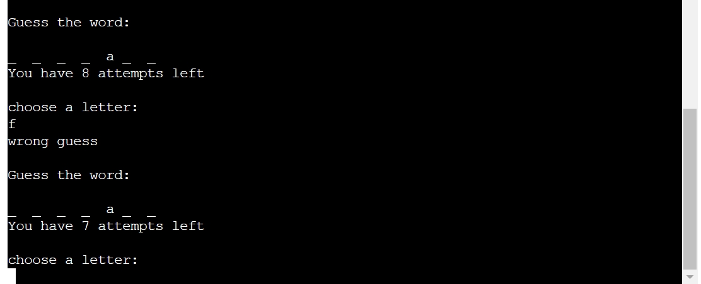 

- When the player enters invalid inputs such as numbers, spacial characters, empty input, space or multiple letters, a warning message regarding invalid input displays to the player. There is no deduction of attempts on invalid inputs.

Invalid Input
   

  - Number Input
  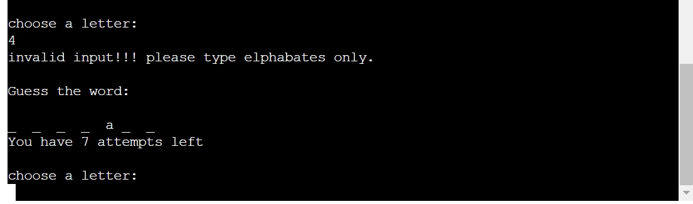  
  
  - Special Characters Input
  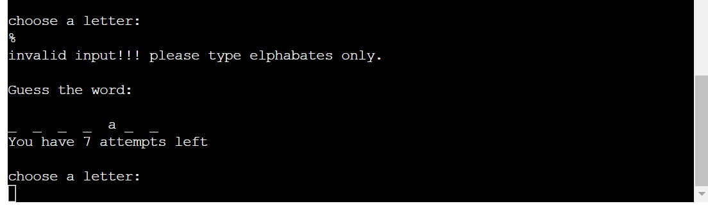  

  - Space Input
  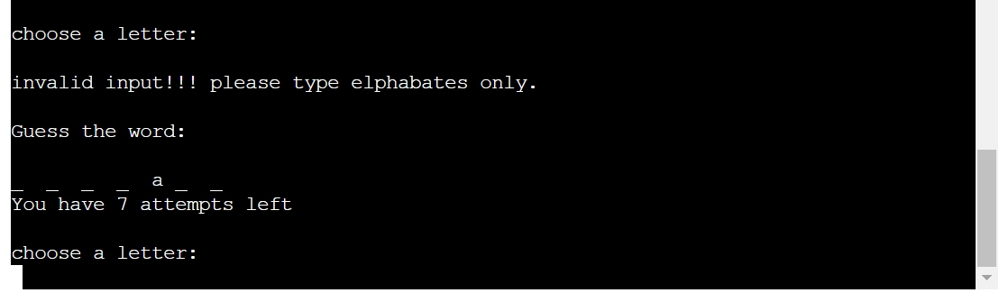  

  - Repeating Input
  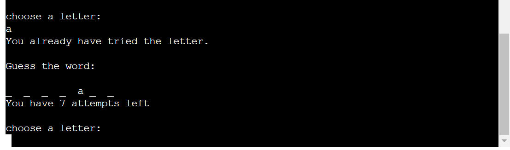  

  - Multiple Letters Input
  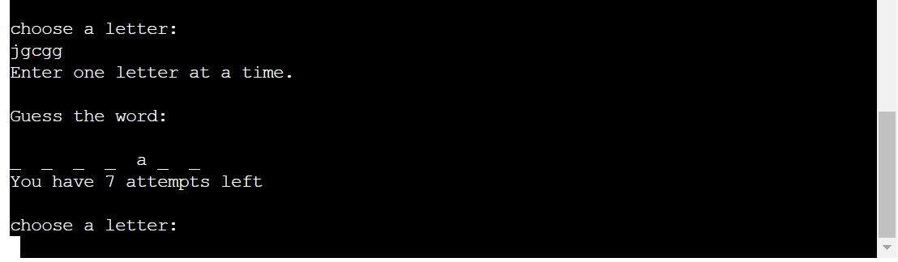  

  - Empty Input
  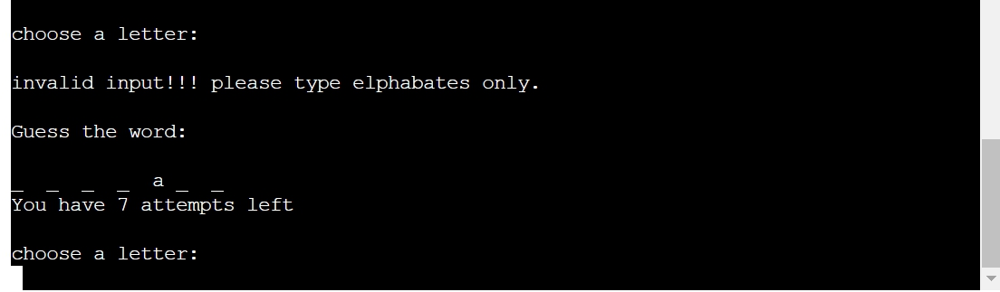 

- If player fails to guess the word a related message displays to the user along with the WORD. Then the player is asked if he/she wants to continue to play or end the game. If player choose "Y" then the game restarts, if the player chooses "N" then the game ends and displays the leaderboard to the player.  

Loose Game

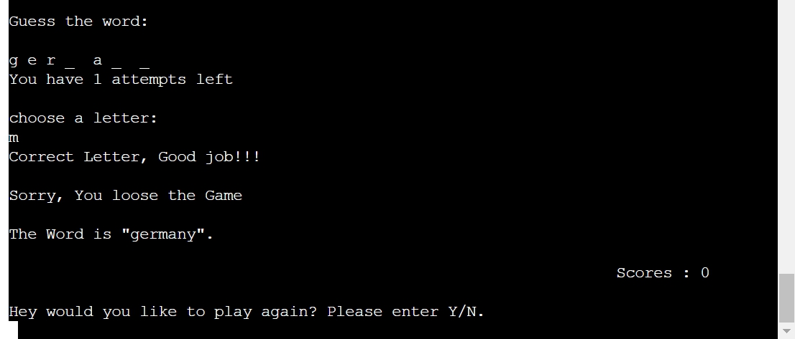 

 

- When player successfully guess the word a related message displays to the user as well as the WORD. Then the player is asked if he/she wants to continue to play or end the game. If player choose "Y" then the game restarts, if the player chooses "N" then the game ends and displays the leaderboard to the player.  

Win Game

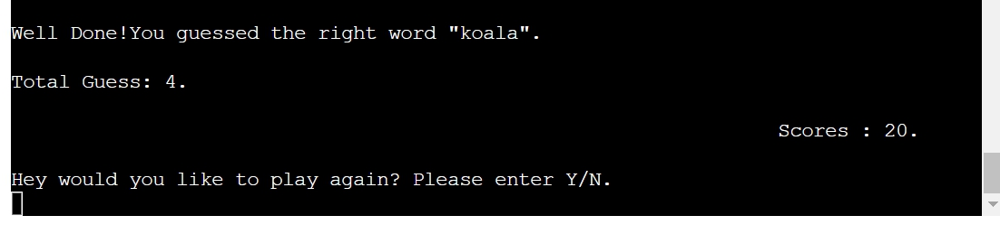 

 

- On winning or loosing the game, player is asked if he/she wants to continue to play or end the game. If player choose "Y" then the game restarts, if the player chooses "N" then the game ends and displays the leaderboard to the player. Always the best scores displays on the Leaderboard. 

Leaderboard

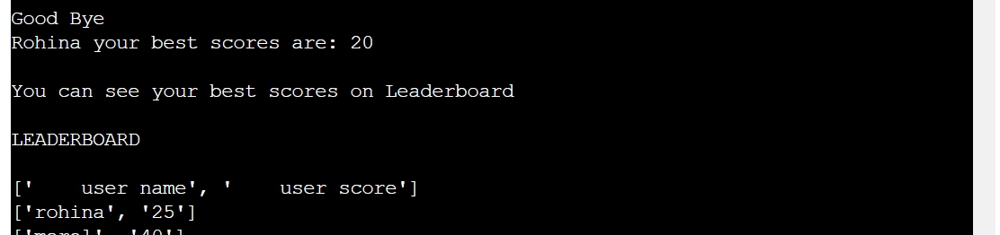 

## Validator Testing

There are no errors or problems being displayed in the Gitpod terminal.

- 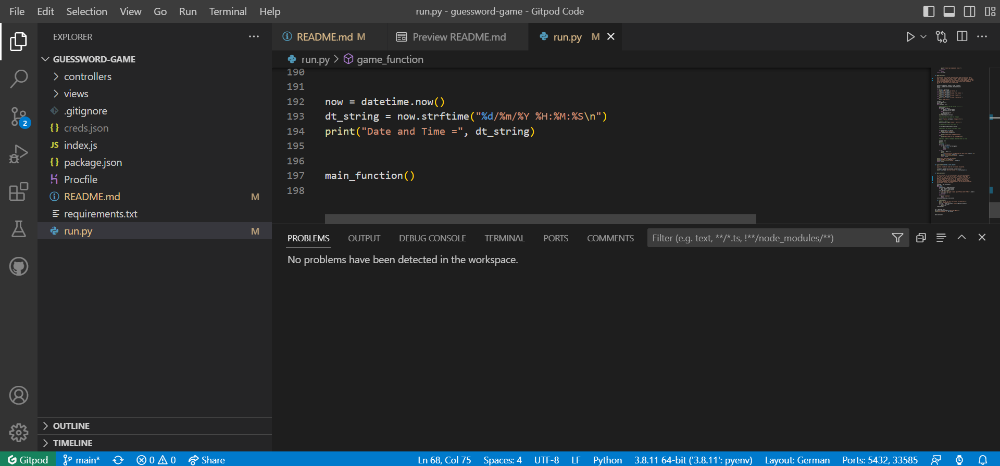

### Bugs or Errors

- I found a bug in the score calculation which i tried my best to solve but i couldnt and the 
  display of the name and score on gspread wasn't in the right order. My Mentor helped me to resolve these issues and also gave me suggestions to improve my code. 
- I forgot to validate the user input and was advised from my mentor to add it as well :) 

## Language and Technologies

- [Python3](https://python.org)

## Frameworks and Libraries
- Random is used to display words from lists randomly.
- Datetime is used to display date and time to the user.
- Googlesheets (gspread) is used to create Leaderboard / Scoreboard.
- Github template provided by Codeinstitute.
- Gitpod to create and write our code.
- Github is used to store the project.
- Heroku is used to deploy and run the project.

## Deployement

I followed the steps written below to deploy my project to [Heroku](https://heroku.com/), based on the [Code Institute](https://codeinstitute.net/) instructions:

- First created a Heroku account by flollowing the instructions given from Code Institute.

- used the `pip3 freeze > requirements.txt` command to install our dependencies to Heroku.
- Commit changes push the changes to Github:
  `git commit -m "Add requirements for deployment”`

In HEROKU after creating the account:

- "Create new App".

- Give the App a unique name and enter region.

- Click on "Create App".

- Click on "Settings" on your new App Dashboard.

- Scroll down to Config Vars to add creds.json files and KEY: PORT and VALUE: 8000 for the 
  deployment.

- Press Add-button.

- Scroll down to Buildpacks and press the icon for Python, click Save Changes, then press the icon  
  for Nodejs and save changes. These Buildpacks need to be in the same order as below:

  -  Python 
  -  NodeJS

- Go to Deploy section tab and scroll down to the Deployment Method.I connect to Github pages and 
  then could search for my Github Repository "guessword-game" and then click connect.

- Scroll down to Automatic and Manual Deploys sections. I clicked on Manual Deployment.

- Then in the Manual Deploy section, press Deploy Branch.

- After the project has been deployed successfully I clicked the View-button to see the program run 
  in the terminal.

## Credits

- [youtube](https://youtube.com/) for videos related to word guess game.
- My mentor helped me to fix bug in the score calculation and adding scores on google 
  spreadsheets.
- [google](https://google.com/) for searching how to import and display date and time
  and data to create different lists of words. 
- [stackoverflow](https://stackoverflow.com/) to learn how to validate user input data.
- README inspiration from sample README Codeinstitute
- Game tested by my husband and my daughter.
- Proofreading for the README done by my husband.

## Content

- Code institute for the READ.md layout.
- [Stackoverflow](https://stackoverflow.com/) for input validation and date and time display.
- [youtube](https://youtube.com/) to add the scores in the game.
- [google](https://google.com/) to create lists of emotions, animal, birds and country names.
