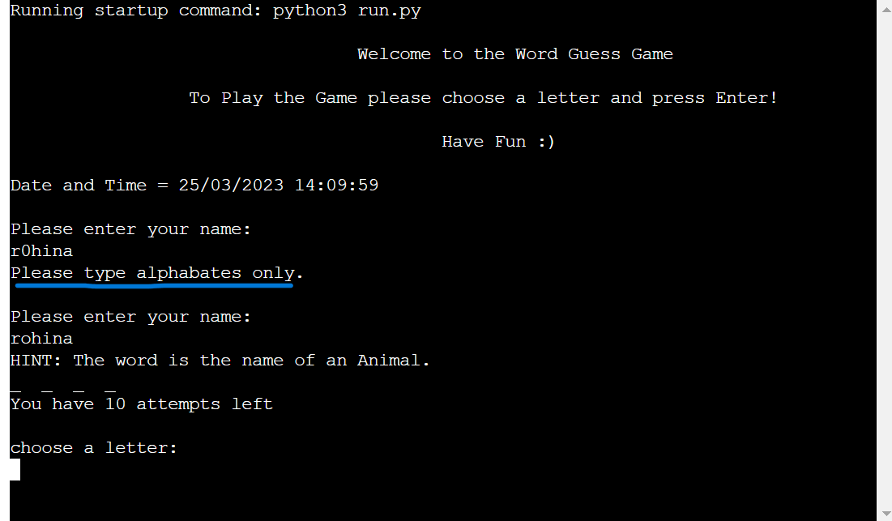
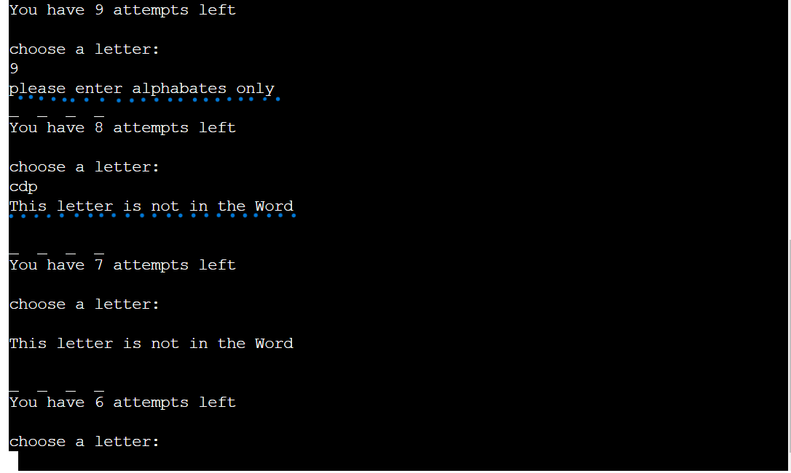

# Word Guess Game
A unique Word Guess Game written in Python and played in terminal.

- 

## Introduction
This simple game displays a secret word that only reveals the length of the word through underscores to represent a letter. A hint will be given to user about the word. You have 10 attempts to guess the word before you run out of lives.
On winning the game the scores will be calculated (5 * with number of guess). The highest Score will be added to the Scoreboard. In case of loosing the game, score will be displayed but will not be added to Scoreboard.

The random word is choosen from different lists created in the code.

## Inspiration

## Basic Information
The purpose of this game is a simple word guess game for entertainment purposes in a termminal environment using Python.

The game is designed keeping user experience in mind:

- User wants to enjoy playing word game.
- user wants to get a hint about the word.
- User wants to win the game and get winning message and scores display when it is achieved.
- User wants to have clear instructions.
- user wants to get rewarded on each guess if wins.
- Provides clear error messages to help the user input the correct values expected.
- User wants the highest scores to be added to the scoreboard.

## Features
- Welcome 
  - The game starts and displayes a welcome message, an instruction to the user and also displays 
    date and time. Then the user is asked to enter his/her name.

- 

- Game Start
  - Game starts when user types his/her name and press enter in order to start playing. A random 
    word displays to the user with a Hint. Now the user needs to guess the word. Total number of attempts are 10.  

- 

- End
  - If the user successfully guesses the word or fails to guess, a message will be displayed to the 
    user to play again or not.

- 

- Leaderboard
  - After exiting the game the user's score will be displayed along with a Leaderboard.
    The Leaderbord shows only the highest score of the user as everyone wants to see the best
    one has done :)

- 

- Score-board
  - Once finishing the game the highest scores will be added to the score-board on            
    Google-spreadsheet i created. 

- 

- Loose
  - If the user fails to guess the word and loose the game the score will display on the 
    Leaderboard but will not be added to the Scoreboard.

- 

## Testing

Tested and validated the code and user input in Heroku terminal. In case a user inputs digits or  
empty space or couple of letters together a message will be displayed to the user.
- 

- 

## Validator Testing

No errors or problems are showing in Gitpod terminal.

- 

### Bugs or Errors

- I found a bug in score calculation which i tried my best to solve but i couldnt and the display
  of the name and score on gspread wasn't in the right order. So my Mentor helped me to solve these issues and improving my code. 
- I forgot to validate user input and got advise from my mentor to add it as well :) 

## Language and Technologies

- [Python3](https://python.org)

## Frameworks and Libraries
- Random is used to display words from lists randomly.
- Datetime is used to display date and time to the user.
- Googlesheets (gspread) is used to create Leaderboard / Scoreboard.
- Github template provided by Codeinstitute.
- Gitpod to create and write our code.
- Github is used to store the project.
- Heroku is used to deploy and run the project.

## Deployement

I followed the steps written below to deploy my project to [Heroku](https://heroku.com/), based on the [Code Institute](https://codeinstitute.net/) instructions:

- First created account on Heroku by flollowing the instructions given from Code Institute.

- pip3 freeze > requirements.txt to install our dependencies to Heroku.
- Commit changes push the changes to Github:
  git commit -m "Add requirements for deployment”

In HEROKU after creating the account:

- "Create new App".

- Give the App a unique name and enter region.

- Click on "Create App".

- Click on "Settings" on your new App Dashboard.

- Scroll down to Config Vars to add creds.json files and KEY: PORT and VALUE: 8000 for the 
  deployment.

- Press Add-button.

- Scroll down to Buildpacks and press the icon for Python, click Save Changes, then press the icon  
  for Nodejs and save changes. These Buildpacks need to be same as in the order below:

  -  Python 
  -  NodeJS

- Go to Deploy section tab and scroll down to Deployment Method.I connect to Github pages and then
  could search for my Github Repository "guessword-game" and then click connect.

- Scroll down to Automatic and Manual Deploys sections. I clicked on Manual Deployment.

- Then in the Manual Deploy section, press Deploy Branch.

- After the project has been deployed successfully I clicked the View-button to see the program run 
  in the terminal.

## Credits

- [youtube](https://youtube.com/) for videos related to word guess game.
- My mentor helped me to fix bug in the score calculation and adding scores on google 
  spreadsheets.
- [google](https://google.com/) for searching how to import and display date and time
  and data to create different lists of words. 
- [stackoverflow](https://stackoverflow.com/) to learn how to validate user input data.
- README inspiration from sample README Codeinstitute

## Content

- Code institute for the READ.md layout.
- [Stackoverflow](https://stackoverflow.com/) for input validation and date and time display.
- [youtube](https://youtube.com/) to add scores in game.
- [google](https://google.com/) to create lists of emotions, animal, birds and country names.
